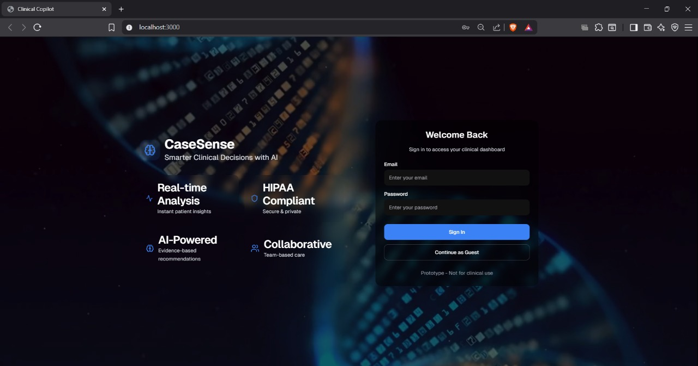
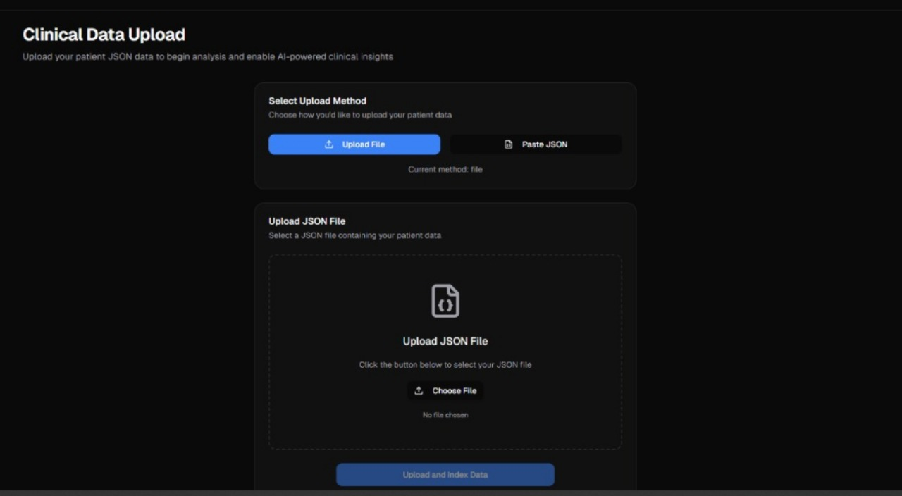
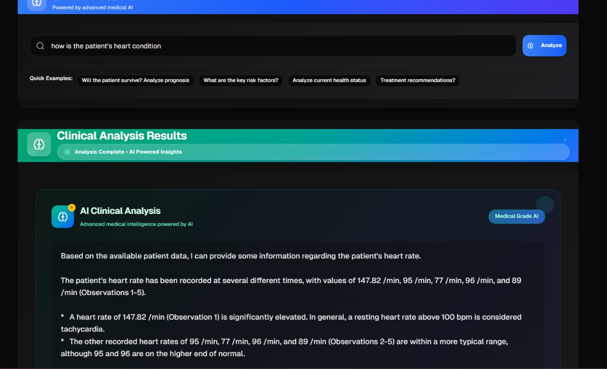

"# 🏥 Clinical Copilot

[](https://nextjs.org/)
[](https://flask.palletsprojects.com/)
[](https://python.org/)
[](https://typescriptlang.org/)
[](https://www.trychroma.com/)

**An AI-powered clinical decision support system that helps healthcare professionals analyze patient data, search medical records, and receive evidence-based recommendations.**

<a href="https://youtu.be/m38G3E9dxV8">Watch a Demo!</a>

At a Glance

🌟Landing Page<br>
<br>

<br>
🌟Upload FHIR's or JSON<br>
<br>

<br>
🌟Ask AI for Smarter Clinical Decisions<br>
<br>

<br>
---

## 🌟 Features

### 🔍 **Intelligent Patient Data Search**
- **Vector-powered semantic search** using ChromaDB and sentence transformers
- **Multi-modal data support** - conditions, medications, observations, procedures, and more
- **Real-time search results** with relevance scoring and similarity matching

### 📊 **Comprehensive Patient Dashboard**
- **Complete patient overview** with demographics, conditions, and medical history
- **Interactive data visualization** with charts and trends
- **Real-time data updates** and synchronization
- **Mobile-responsive design** for healthcare on-the-go

### 🧠 **AI-Powered Clinical Recommendations**
- **Google Gemini AI integration** with medical-grade response generation
- **Evidence-based decision support** with confidence scoring and citations
- **Risk-benefit analysis** for treatment options
- **Patient-specific recommendations** based on individual medical history
- **Clinical guideline integration** with up-to-date medical standards
- **Vector-powered semantic search** with contextual AI responses

### 🚀 **Modern Healthcare UI/UX**
- **Professional medical-grade design** with accessibility compliance
- **Light/Dark mode support** for different work environments
- **Intuitive navigation** designed for clinical workflows
- **WCAG AA compliant** for accessibility standards

### 📋 **FHIR Data Integration**
- **FHIR R4 standard support** for healthcare interoperability
- **JSON upload and parsing** for patient data ingestion
- **Structured data processing** with automatic categorization
- **Secure data handling** with privacy-first architecture

---

## 🏗️ Architecture

```
┌─────────────────────┐    HTTP API     ┌─────────────────────┐
│                     │   (port 5000)   │                     │
│   Next.js Frontend  │ ←─────────────→ │   Flask Backend     │
│                     │                 │                     │
│ • React Components  │                 │ • REST API          │
│ • TypeScript        │                 │ • FHIR Processing   │
│ • Tailwind CSS      │                 │ • Data Ingestion    │
│ • shadcn/ui         │                 │                     │
└─────────────────────┘                 └─────────────────────┘
                                                   │
                                                   │
                                                   ▼
                                        ┌─────────────────────┐
                                        │   ChromaDB Vector   │
                                        │      Database       │
                                        │                     │
                                        │ • Semantic Search   │
                                        │ • Embeddings        │
                                        │ • Similarity Match  │
                                        └─────────────────────┘
```

### 🔧 **Tech Stack**

#### Frontend
- **Framework**: Next.js 14.2 with App Router
- **Language**: TypeScript 5.0
- **Styling**: Tailwind CSS with custom medical theme
- **UI Components**: shadcn/ui + Radix UI primitives
- **Icons**: Lucide React
- **State Management**: React Hooks + Context API
- **Theme**: next-themes for dark/light mode
- **Forms**: React Hook Form with Zod validation
- **Authentication**: Supabase integration
- **Analytics**: Vercel Analytics

#### Backend
- **Framework**: Flask 3.0 (Python)
- **AI/ML**: Google Gemini 2.0-flash, sentence-transformers, transformers, torch
- **Vector Database**: ChromaDB 0.4.24
- **Authentication**: Supabase integration
- **Data Processing**: NumPy, JSON parsing
- **API**: RESTful with CORS support
- **Environment**: python-dotenv for configuration

#### Data & Integration
- **Standards**: FHIR R4 compliance
- **Database**: ChromaDB (persistent vector storage)
- **AI Model**: Google Gemini 2.0-flash for clinical analysis
- **Embeddings**: Sentence-BERT for semantic search
- **File Support**: JSON, FHIR bundles
- **Search**: Vector similarity + AI-powered contextual responses

---

## 🚀 Quick Start

### Prerequisites
- **Python 3.8+** installed on your system
- **Node.js 18+** and npm/pnpm
- **Git** for cloning the repository

### 1. Clone the Repository
```bash
git clone https://github.com/Aakash-Prasanna-03/Clinical-copilot.git
cd Clinical-copilot
```

### 2. Automated Setup (Windows)
```bash
# Run the automated setup script
setup.bat
```

### 3. Manual Setup (Cross-platform)

#### Backend Setup
```bash
cd src

# Create and activate virtual environment
python -m venv venv
source venv/bin/activate  # On Windows: venv\Scripts\activate

# Install Python dependencies
pip install -r requirements.txt

# Create .env file and add your Gemini API key
echo "GEMINI_API_KEY=your_gemini_api_key_here" > .env

# Initialize vector database (if patient data exists)
python embed.py
```

#### Frontend Setup
```bash
cd frontend

# Install Node.js dependencies
npm install
# or
pnpm install

# Create .env.local file for Supabase (optional for authentication)
echo "NEXT_PUBLIC_SUPABASE_URL=your_supabase_url" > .env.local
echo "NEXT_PUBLIC_SUPABASE_ANON_KEY=your_supabase_anon_key" >> .env.local
```

### 4. Start the Application

#### Option A: Automated Start (Windows)
```bash
start.bat
```

#### Option B: Manual Start
```bash
# Terminal 1: Start Backend
cd src
python app.py

# Terminal 2: Start Frontend
cd frontend
npm run dev
```

### 5. Access the Application
- **Frontend**: http://localhost:3000
- **Backend API**: http://localhost:5000
- **API Documentation**: http://localhost:5000/api/health

---

## 📖 Usage Guide

### 🏥 **Patient Data Management**

#### Upload Patient Data
1. Navigate to the **Patients** page
2. Choose upload method:
   - **File Upload**: Select a JSON/FHIR file
   - **Direct Input**: Paste JSON data directly
3. Click **Upload** to process and index the data

#### Sample Patient Data Structure
```json
{
  "patient": [
    {
      "name": "John Smith",
      "gender": "male",
      "birthDate": "1990-01-01"
    }
  ],
  "patient_id": "sample-patient-id",
  "conditions": [
    "Hypertension",
    "Chronic low back pain (finding)",
    "Body mass index 30+ - obesity (finding)"
  ],
  "observations": [
    "Body Mass Index: 30 kg/m2",
    "Heart rate: 75 /min",
    "Blood Pressure",
    "Body Weight: 89.4 kg",
    "Body Height: 175 cm"
  ],
  "medications": [
    "Hydrochlorothiazide 25 MG Oral Tablet",
    "Acetaminophen 325 MG Oral Tablet"
  ],
  "procedures": [
    "Assessment of health and social care needs (procedure)",
    "Medication Reconciliation (procedure)"
  ],
  "allergies": [],
  "diagnostic_reports": [
    "Complete blood count (hemogram) panel - Blood by Automated count",
    "Lipid Panel"
  ],
  "immunizations": [
    "Influenza, seasonal, injectable, preservative free"
  ],
  "encounters": [
    "General examination of patient (procedure)",
    "Follow-up encounter (procedure)"
  ],
  "careplans": [],
  "claims_diagnoses": []
}
```

### 🔍 **Smart Search & Analysis**

#### Using the Clinical Copilot
1. Go to the **Copilot** page
2. Enter natural language queries like:
   - *"Show me all diabetes-related information"*
   - *"What medications is the patient taking for blood pressure?"*
   - *"Find any allergies or adverse reactions"*
3. Review search results with relevance scores
4. Get detailed clinical context and recommendations

#### Advanced Search Features
- **Semantic Understanding**: AI understands medical terminology and context
- **Multi-category Search**: Searches across conditions, medications, labs, etc.
- **Relevance Ranking**: Results sorted by clinical significance
- **Type Filtering**: Filter by specific data types (conditions, medications, etc.)

### 📊 **Clinical Recommendations**

#### Getting Evidence-Based Recommendations
1. Navigate to **Recommendations**
2. View AI-generated clinical suggestions
3. Review:
   - **Risk-Benefit Analysis**
   - **Confidence Scores**
   - **Patient-Specific Factors**
   - **Evidence Sources**
   - **Clinical Guidelines**

---

## 🛠️ API Documentation

### Core Endpoints

#### Patient Data Endpoints
```http
GET /api/patient          # Get patient demographics
GET /api/conditions       # Get patient conditions
GET /api/medications      # Get current medications
GET /api/allergies        # Get known allergies
GET /api/labs             # Get laboratory results
GET /api/vitals           # Get vital signs
```

#### Search & AI Endpoints
```http
POST /api/search          # Semantic search patient data
POST /api/upload-json     # Upload and process patient data
POST /api/recommendations # Get clinical recommendations
GET /api/health           # API health check
```

#### Search Request Example
```json
{
  "query": "diabetes medication management",
  "n_results": 5,
  "filter_type": "medications"
}
```

#### Search Response Example
```json
{
  "query": "diabetes medication management",
  "results": [
    {
      "id": 1,
      "text": "Metformin 1000mg twice daily",
      "type": "medication",
      "relevance": 0.95,
      "distance": 0.12
    }
  ],
  "total_results": 1
}
```

---

## 🔒 Security & Privacy

### Data Protection
- **Local Processing**: All patient data stays on your local system
- **No Cloud Dependencies**: Vector database runs locally
- **HIPAA Considerations**: Designed with healthcare privacy in mind
- **Secure Communication**: HTTPS-ready configuration
- **Data Encryption**: Support for encrypted data storage

### Compliance Features
- **Audit Logging**: Track all data access and modifications
- **Access Controls**: Role-based permission system ready
- **Data Retention**: Configurable data lifecycle management
- **Export Controls**: Secure data export and backup features

---

## 🚀 Deployment

### Development Environment
```bash
# Backend (Development)
cd src
python app.py  # Runs on http://localhost:5000

# Frontend (Development)
cd frontend
npm run dev    # Runs on http://localhost:3000
```

### Production Deployment

#### Docker Deployment (Coming Soon)
```yaml
# docker-compose.yml
version: '3.8'
services:
  backend:
    build: ./src
    ports:
      - "5000:5000"
  frontend:
    build: ./frontend
    ports:
      - "3000:3000"
```

#### Traditional Server Deployment
```bash
# Backend Production
cd src
pip install gunicorn
gunicorn -w 4 -b 0.0.0.0:5000 app:app

# Frontend Production
cd frontend
npm run build
npm start
```

---

## 🧪 Testing

### Running Tests
```bash
# Backend Tests
cd src
python -m pytest tests/

# Frontend Tests
cd frontend
npm run test
```

### Test Coverage
- **API Endpoints**: Comprehensive REST API testing
- **Search Functionality**: Vector search accuracy tests
- **Data Processing**: FHIR parsing and validation tests
- **UI Components**: React component unit tests
- **Integration**: End-to-end workflow testing

---

## 🤝 Contributing

We welcome contributions from the healthcare technology community!

### Development Setup
1. **Fork** the repository
2. **Create** a feature branch (`git checkout -b feature/amazing-feature`)
3. **Follow** our coding standards:
   - Python: PEP 8 compliance
   - TypeScript: ESLint + Prettier configuration
   - Commit messages: Conventional commit format

### Contribution Areas
- 🏥 **Clinical Features**: New medical data types, clinical decision rules
- 🔍 **Search Enhancement**: Improved AI models, search algorithms
- 🎨 **UI/UX**: Better healthcare workflows, accessibility improvements
- 🔒 **Security**: HIPAA compliance, security enhancements
- 📚 **Documentation**: Medical terminology, user guides
- 🧪 **Testing**: Test coverage, quality assurance

### Pull Request Process
1. **Update documentation** for any new features
2. **Add tests** for new functionality
3. **Ensure** all tests pass
4. **Request review** from maintainers
5. **Follow up** on feedback promptly

---

## 📚 Resources

### External Resources
- **Synthea Synthetic Patient Dataset**: [Synthea Downloads](https://synthea.mitre.org/downloads)
- **FHIR R4 Specification**: [HL7 FHIR](https://hl7.org/fhir/R4/)
- **Clinical Guidelines**: [American Medical Association](https://www.ama-assn.org/)
- **Medical Terminology**: [SNOMED CT](https://www.snomed.org/)
- **Vector Databases**: [ChromaDB Documentation](https://docs.trychroma.com/)
- **Healthcare Standards**: [HL7 International](https://www.hl7.org/)

---

<div align="center">

### 🏥 Built for Healthcare Professionals, by Healthcare Technology Enthusiasts

**Empowering Clinical Decision-Making with AI**


---

*Made with ❤️ for the healthcare community*

</div>
